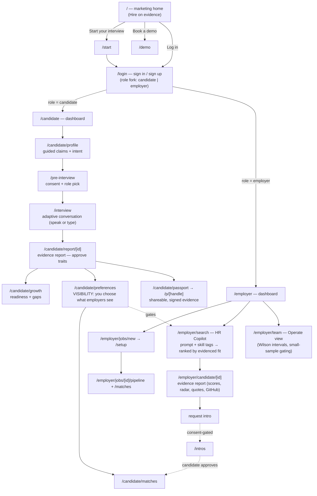

# PlacedOn — system operation map

> How the product actually operates: two journeys that meet at one consent gate.
> Written 2026-07-24. Source of truth is the route graph under `src/app`.

The whole product is one idea: **a candidate proves their work once, controls who
sees it; an employer searches that evidence, never identity.** Everything below
serves that. The two sides never touch except through a candidate-approved intro.

---

## The two journeys

**Read it as:** the candidate builds evidence and sets visibility; the employer
can only ever search and see what the candidate has approved. `/intros` is the
one bridge, and it is consent-gated in both directions.

---

## Surface responsibilities

| Surface | Route | Job | Data source today |
|---|---|---|---|
| Marketing home | `/` | Convert → start a journey | static |
| Auth | `/login` | Sign in / up, role fork, `?next=` return | Supabase (live) |
| Candidate dashboard | `/candidate` | Honest status, next action | mock / live snapshot |
| Profile builder | `/candidate/profile` | Capture claims + intent | Supabase profiles |
| Interview | `/pre-interview` → `/interview` | The one adaptive conversation | **backend + LLM (down)** |
| Report / Growth | `/candidate/report/[id]`, `/candidate/growth` | Approve traits, see readiness | backend (down) → mock |
| Preferences | `/candidate/preferences` | **Visibility control** | Supabase |
| Passport | `/candidate/passport`, `/p/[handle]` | Signed, shareable evidence | backend |
| Employer dashboard | `/employer` | Team status | mock / live |
| **HR Copilot** | `/employer/search` | Prompt + tags → evidenced-fit ranking | **local pool now**, `v1.copilotSearch` when live |
| Employer report | `/employer/candidate/[id]` | Full evidence report for one candidate | backend → mock |
| Intros | `/intros` | Consent-gated introductions | backend |
| Team / Operate | `/employer/team` | Process quality, Wilson intervals | mock |
| Trust | `/trust/*` | LL144 / EU AI Act / model health / contest | static |

---

## Operational status (what's live vs waiting on the backend)

- **Frontend:** live on Vercel → `placedon.com`.
- **Auth:** live (Supabase email/password, per-request JWT, RLS).
- **Backend (`Code/PlacedOn`, Render):** **DOWN — 502 / OOM on the Starter tier.**
  Bump to Standard (2 GB) + add `ANTHROPIC_API_KEY` and `LLM_PROVIDER`, then wire
  the frontend (`NEXT_PUBLIC_API_BASE_URL`, `NEXT_PUBLIC_WS_BASE_URL`).
- **Degrade-gracefully rule:** every surface that wants the backend falls back to
  mock/local so the product is always demoable. `isLiveBackend()` is the single
  switch. The HR Copilot ranks a local evidence pool until that flips.

### The one wiring step that lights up the whole system

Once `/health` is green on Standard and the two `NEXT_PUBLIC_*` vars point at it,
the interview runs for real, reports populate from real transcripts, and the HR
Copilot ranks live candidates instead of the local pool — no frontend code change,
just env + redeploy.
